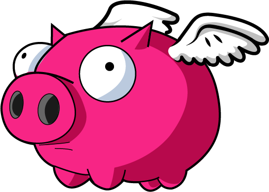

<p align="center">
  
</p>

# Pigasus

> Custom starter-kit for building web projects.
>
> If you are starting a JS hobby project, or a one off idea and need a toolkit
> to get started, whynot Pigasus?!
>
> Launch tasks to build out tried and true css javascript and html
> from a variety of starting points, like Lit.js, Riot, Pug.js, SCSS and more!

## Features

  - **Browserify** - `require('modules')` in the browser by bundling up all of your dependencies. [Browserify.org](https://browserify.org/)
  - **Lit** - Build out web components with ease! [Lit](https://lit.dev/)
  - **Riot.js** - Compile custom tag based UI Library [Riot.js](https://riot.js.org/)
  - **Pug** - Compile Pug templates to HTML files with [jstransformer](https://www.npmjs.com/package/jstransformer) filters
  - **Rollup.js** - Rollup.js Task Manager Integration [Rollup.js](https://rollupjs.org/guide/en/)
  - **Typeset** - HTML pre-processor for web typography which provides typographic features. [Typeset](https://www.npmjs.com/package/typeset)
  - **lint** - Lint a project to find and diagnose errors quickly
  - **style sheets** - Dart-Sass, CSS + minify + concat, Style Lint etc.
  - **JSON tools** - JSON to SCSS, create JSON objects from directories


## Install

Grab **Pigasus** from the repository: [Pigasus Repo](https://github.com/huement/pigasus):

```sh
$ git clone https://github.com/huement/pigasus.git
```

Or [download as ZIP](https://github.com/huement/pigasus/archive/master.zip).

## Usage

1. Install Node Modules:

   ```sh
   $ npm install
   ```

2. Setup your project links

   ```json
   // gdb.json
   {
    "dev": {
      "website": "example",
      "sass": "example/scss",
      ...
    }
   }
   ```

3. Configure the flow. Run tasks concurrently or async (one after another). Tasks can run infinitely (Browsersync live reload), or run once and done.

   ```json
   {
      "name": "dev",
      "desc": "live development mode",
      "task": "cat,browserSync,watch:all"
   }
   ```

4. Run any of the tasks, watch pigasus fly, and realize how easy javascript can be.


### Examples

Pigasus comes with an `example` directory that gives you a starting point for a number of projects. The idea behind pigasus is that its a jumping off point for mocking up your next big idea, as such there is no exact instructions, as every project is unique.


| Directory | Task       |  Description                |
| --------- | --------   | -------------------------   |
| `lit`     | browserify | Build out lit.js components |
| `pug`     | pug        | Templates + filters to html |
| `riot`    | shell:riot | Compile riot files to a UI  |
| `scss`    | dart-sass  | Turn modern sass into css3  |


### Pigasus Backstory

Ive put this toolkit together, and am releasing it, with hopes that some of you might check it out and fall in love with the workflow the way I have. I love how tasks are nice little `json` files with minimal configuration, pulling from a single global config file (`gdb.json`) which allows for **DRY** and easily tweak and update things when changes inevitably occur.

### Contributions

**This is where you come in!** I know this isnt perfect. it needs some work. Im looking for help / feedback into making this project more than just lipstick on a pig, ideally I want the whole hog christmas pig in space. So please take this as an open invitaion to help out, contact me with suggestions, submit pull requests, whatever and however you want to contribute.

#### History

For detailed changelog, check [Releases](https://github.com/huement/pigasus/releases).

#### License

[MIT License](http://opensource.org/licenses/MIT)
